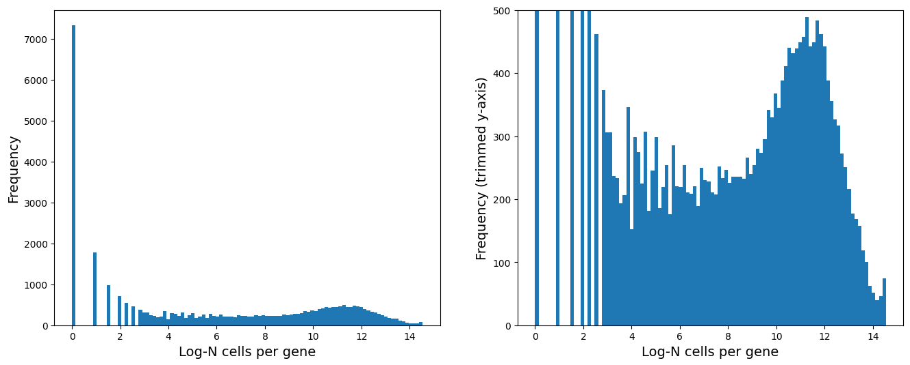
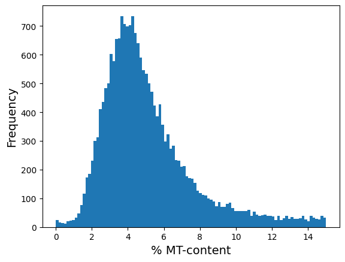
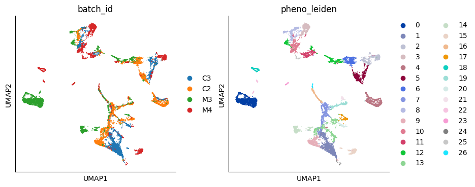
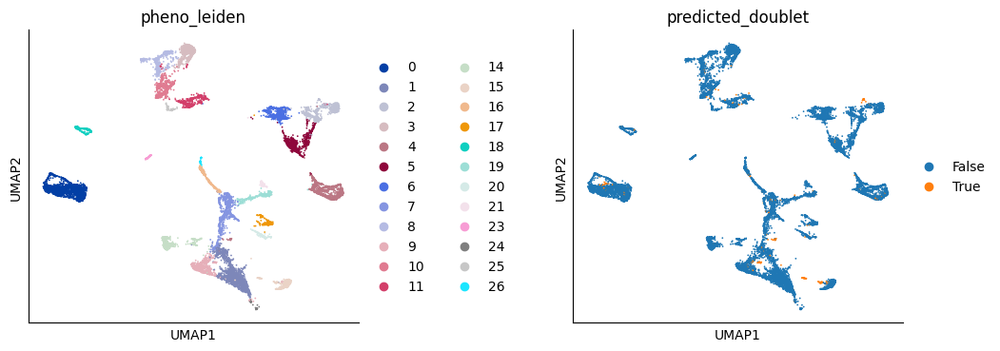
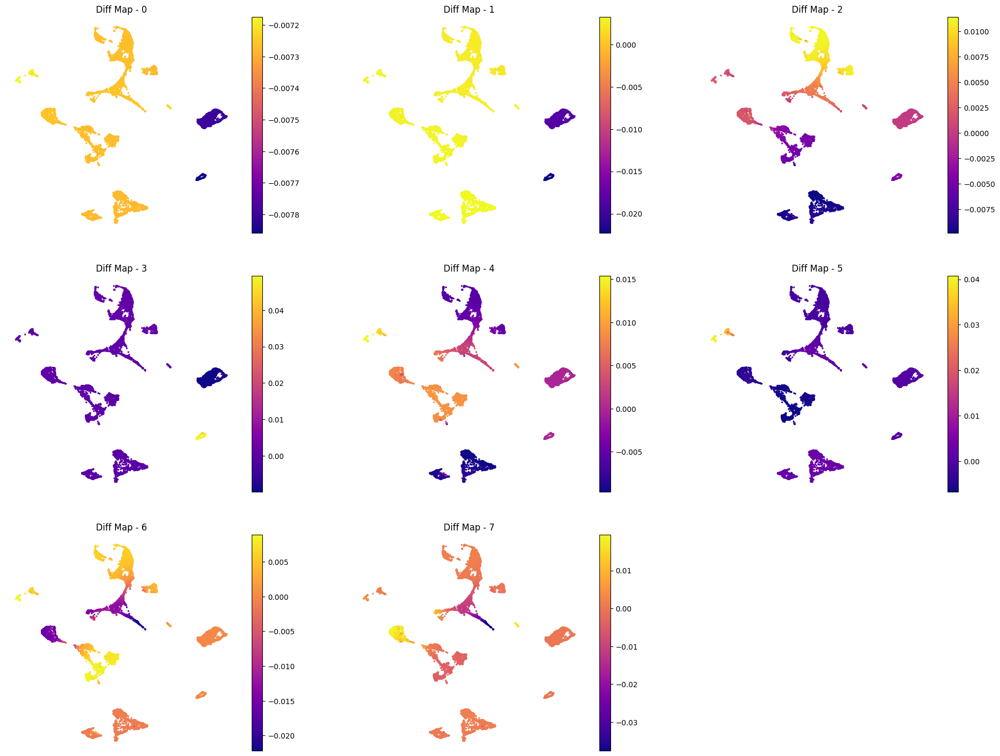
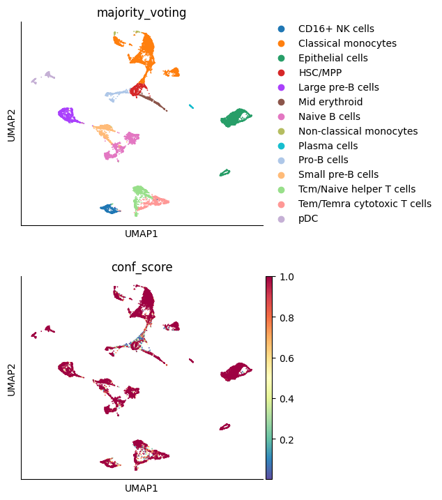

# Investigating gene expression patterns across different neuroblastoma conditions using single-cell RNA-seq data

Erdos Data Science Boot Camp (Fall 2024)
Group: Sangeevan Vellappan, Jingyun Qiu

## Background

Neuroblastoma accounts for 15% of all pediatric cancer deaths. It is highly heterogeneous due to distinct genetic and epigenetic alterations. single-cell RNA sequencing (scRNA-seq) is particularly essential for neuroblastoma research because it allows researchers to characterize tumor heterogeneity, profiling tumor microenvironment and reveal gene expression patterns across different cell types under different conditions. Therefore, scRNA-seq offers insights into the neuroblastoma research, which also contributes to the broader scientific knowledge that benefits cancer biology as a whole.

### Goal

This study aims to uncover unique gene expression signatures associated with specific cell types and conditions, aiding in the identification of potential diagnostic markers and therapeutic targets. By leveraging scRNA-seq data, we can explore these patterns at high resolution and gain insights into how cellular heterogeneity in disease conditions and how the interplay between gene expression contribute to disease progression.

### Stakeholders

1. Researchers and clinicians: Understanding cellular-level changes in gene expression can aid in the diagnosis, prognosis, and development of targeted treatments.
2. Biotechnology and pharmaceutical companies: Identifying new drug targets based on disease-specific gene expression signatures.
3. Policy makers and health organizations: Utilizing research findings to inform public health strategies and personalized medicine approaches.

### Why reanalyzing published scRNA-seq data?

1. Leveraging machine learning for deeper insights: With advancements in machine learning tools like CellTypist, reanalysis can identify and classify cell types with higher accuracy and granularity, enabling the discovery of novel insights and relationships that were not evident in the original study.
2. Integrating domain expertise for contextualized predictions: Machine learning models are only as good as the context in which they are applied. By combining updated computational techniques with our biological expertise, we refine predictions and generate hypotheses that align with domain-specific knowledge.
3. Enhancing reproducibility through comprehensive pipelines: Many publications focus on sharing figure generation scripts, leaving the critical preprocessing and analysis steps under-documented. Here, we provide a complete and transparent pipeline from data preprocessing to in-depth analysis using publicly available datasets. This ensures reproducibility and provides the community with a robust resource to explore scRNA-seq data.
4. Detailed rationale for preprocessing and cleanup: We include detailed justifications for every preprocessing and data-cleaning step. For instance, we analyze the percentage of mitochondrial and ribosomal gene expression in cells, visually demonstrating thresholds and their biological relevance. By doing so, we explain the rationale behind filtering out certain cells or genes with high mitochondrial or ribosomal content, ensuring the dataset's integrity while maintaining reproducibility and scientific rigor.

## Dataset

The dataset for this project is obtained from "Fetahu IS, Esser-Skala W, Dnyansagar R, Sindelar S et al. Single-cell transcriptomics and epigenomics unravel the role of monocytes in neuroblastoma bone marrow metastasis. Nat Commun 2023 Jun 26;14(1):3620. PMID: 37365178"

### GEO accession (GSE216176): https://www.ncbi.nlm.nih.gov/geo/query/acc.cgi?acc=GSE216176

1. GSE216176/GSM6659415_C2_filtered_feature_bc_matrix.h5 (healthy control cells 1)
2. GSE216176/GSM6659416_C3_filtered_feature_bc_matrix.h5 (healthy control cells 2)
3. GSE216176/GSM6659422_M3_filtered_feature_bc_matrix.h5 (tumor cells 1)
4. GSE216176/GSM6659423_M4_filtered_feature_bc_matrix.h5 (tumor cells 2)

## Notebooks

### Data_loading_and_processing.ipynb

This notebook includes a range of data preprocessing including:
1. Quality control to evaluate the number of genes expressed per cell and mitochondrial gene content.
2. Assess data distribution and identify appropriate threshold/parameters for data cleaning.
   1) The total counts per cell
   2) Number of genes expressed per cell
   3) Mitochondrial gene content

### Analysis.ipynb

This notebook includes data normalization and feature selection in scRNAseq-seq data.

#### Data normalization

Data normalization is to filter out the sequencing depth bias. This ensures the representation of cellular heterogeneity is due to biological variation rather than sequencing depth variation. The normalization method we employ is "Median library Size Normalization". Using the median as the reference for normalization is particularly robust, as it is less sensitive to extreme values than the mean. This ensures that cells with unusually high or low library sizes (e.g., due to sequencing artifacts) do not disproportionately influence the scaling factor.

#### Highly variable genes

The goal of this step is to identify genes with the greatest variation across cells. This high variability indicates that these genes are differentially expressed across cell populations, as they capture the most informative biological differences between cells, such as cell types, states, or transitions, while reducing noise from less informative or housekeeping genes. This helps making them valuable for downstream analyses like clustering and identifying distinct cell states or types.

#### PCA (Principal Component Analysis)

PCA is an algorithm used for dimensionality reduction. It is based on linear algebra and statistics that helps identify principal components in which the variance of a dataset is maximized. We apply PCA in our scRNA-seq analysis to achieve the following goals
1) Capture significant patterns or features while reducing noise and dimensionality.
2) Build a K-nearest neighbors (KNN) graph on the data based on the PCA representation.
3) Specify the number of principle components and use PCA-reduced data as input for subsequent analysis such as clustering and visualization.

#### UMAP (Uniform manifold approximation and projection)

UMAP is a non-linear dimensionality reduction technique commonly used in scRNA-seq analysis to visualize high-dimensional data in 2D or 3D. Unlike PCA, UMAP preserves both local and global structures, making it ideal for capturing complex biological relationships. For this analysis, we used 30 neighbors (n_neighbors=30) to capture local connections while maintaining global trends and min_dist=0.1 to highlight tight clusters, revealing subtle differences between cell populations. These settings help provide a clear, interpretable visualization of the dataset.

#### Doublet Detection using Scrublet

Doublet detection using Scrublet is a machine-learning-based approach to identify and filter out doublets, which are artifacts in scRNA-seq data. Doublets occur when two cells are captured together and sequenced as a single "cell," leading to mixed gene expression profiles that can distort downstream analyses like clustering, cell-type identification, and differential expression.

Scrublet applies a k-nearest neighbors (k-NN) algorithm to simulate doublets and then uses a classifier to identify cells with doublet-like gene expression profiles. From a machine learning perspective, this involves:

Data Augmentation: Simulating artificial doublets by combining expression profiles of two random cells.
Feature Engineering: Using gene expression profiles as features to distinguish between real cells and doublets.
Classification: A classifier (typically a probabilistic model) is trained to assign a likelihood score to each cell based on its similarity to simulated doublets.
In a data science context, Scrublet helps clean the dataset by removing noisy data points (doublets), thereby improving the accuracy of downstream models and analyses.

#### Scanpy inbuilt diffusion maps

Diffusion maps are a dimensionality reduction technique, which is used to infer cellular trajectory. They are particularly effective for capturing continuous trajectories, such as cell state changes or differentiation processes, by focusing on the connectivity structure of the data. In our analysis, diffusion components 0 and 1 clearly distinguish healthy cells from tumor cells. This provides an excellent starting point to identify specific genes and pathways involved in the transition from healthy cells to tumor cells, offering insights into the underlying mechanisms of tumorigenesis. By capturing these transitions, diffusion maps help uncover critical biological shifts that are otherwise challenging to detect.

#### Cell Typing

CellTypist is a machine learning tool designed to streamline cell type annotation in single-cell RNA sequencing data. Using a vast reference database of single-cell transcriptomes and pre-trained models, it predicts cell types based on gene expression profiles. 

In our analysis, we began by identifying distinct patterns in control (C) and MYCN-amplified (M) (or tumor cells for easy reference) samples using UMAP, which allowed us to visually separate the two groups based on overall expression profiles. This provided an initial understanding of how these samples differ in their cellular composition and clustering behavior.

Next, we zoomed into specific clusters to explore differential gene expression of key markers like MYCN, PHOX2B, DMXL2, and IGHD. By examining marker gene expression within these clusters, we could gain insights into the biological characteristics of each cluster, particularly noting positive markers for MYCN-amplified cells, which further emphasized the distinction between C and M samples.

To capture finer, continuous transitions and lineage relationships, we then employed diffusion maps. This method helped us visualize cellular trajectories and potential transitions, particularly useful for tracking cell states or differentiation paths. Diffusion maps confirmed our previous findings, reinforcing the distinct profiles between control and MYCN-amplified cells, while also revealing subtle structures and relationships among clusters.

Finally, to bring biological meaning and consistency to each cluster, we now turn to automated cell typing using CellTypist. Leveraging machine learning, CellTypist builds upon our clustering and gene expression insights, assigning well-defined cell-type labels based on extensive reference data. This step enables us to systematically annotate the clusters, providing an objective and scalable approach to define cell types across the control and MYCN-amplified samples. By completing this automated cell-typing step, we finalize our analysis pipeline with cell-type annotations that are both biologically interpretable and reproducible, transforming our data into a comprehensive cell atlas of the neuroblastoma-infiltrated bone marrow environment.

#### Models and Data

CellTypist provides a variety of models available to download from https://www.celltypist.org/models. As of November 3, 2023, there are 42 models available. All models are for immune cells, sourced from multiple different organisms and tissues, and vary in health and diseases. Models are saved as pickle files.

For our analysis, we used "Immune_All_Low" model for cell type annotation in neuroblastoma-infiltrated bone marrow because Neuroblastoma is known to infiltrate the bone marrow, where it interacts with various immune cells. Using an immune-focused model is suitable because it will capture the diversity of immune cell types likely present in the tumor microenvironment, allowing for an in-depth analysis of immune cell populations and their roles in neuroblastoma progression and response. Although neuroblastoma-specific models are unavailable, the immune low-resolution model provides a broad view of immune subtypes, helping us identify potential immune cell dynamics in neuroblastoma-infiltrated samples.

#### Annotate

We run CellTypist annotation on the dataset using 'prob match' mode for more detailed probability matching. Specifically, we instruct CellTypist to output probabilities for each possible cell type label, rather than assigning a single label. This mode provides a ranked list of cell type probabilities, allowing us to understand how closely each cell matches multiple cell types. 

